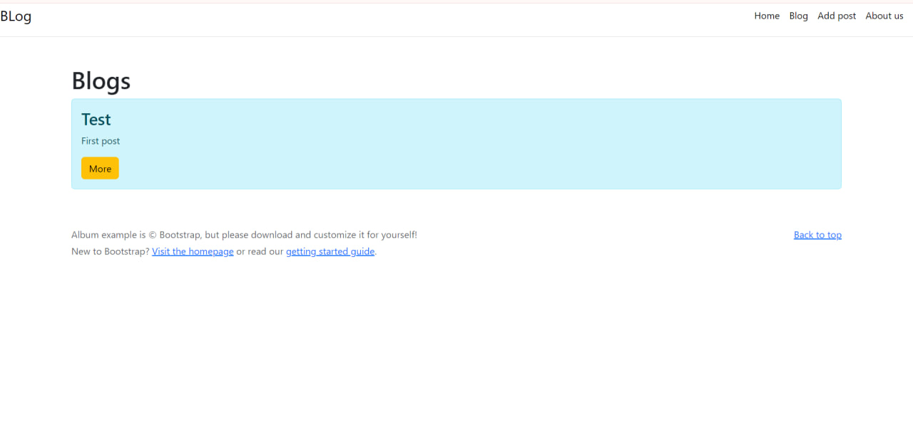

# Java Blog

First project on Java + Spring

## Description

In this project Java and Spring were used plus connected to databases (CRUD), HTML(bootstrap). 
 

## Getting Started

### Dependencies
All dependencies for normal operation are connected in pom.xml

### Executing program

1)Clone project in IntellIJ IDEA  
2)Connect to database( in my case via Open Server Panel), change the data to its own in the application.properties file    
3)Launch  

## Version 

Java - correto 17 
Spring - 3.2.0  
phpMyAdmin - 5.2.0  

